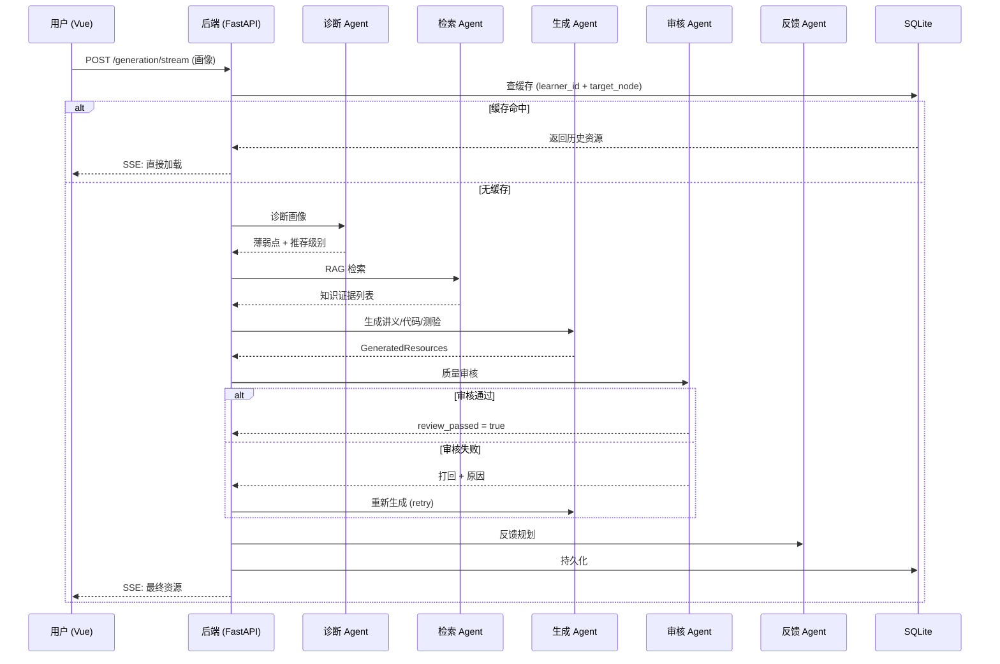
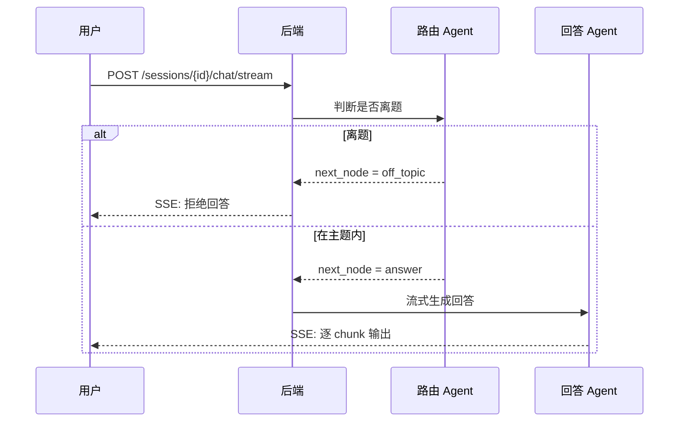

# AgentEdu 系统架构说明

> 文档版本: v1.0 | 最后更新: 2026-06-22

---

## 一、架构总览

系统采用 **前后端分离 + 多智能体微服务** 架构，分为四个核心层级：

```
┌─────────────────────────────────────────────┐
│            前端展现层 (Vue 3 + Pinia)          │
│  Dashboard │ LearningPath │ LearningView     │
└───────────────────┬─────────────────────────┘
                    │ HTTP / SSE
┌───────────────────▼─────────────────────────┐
│            业务网关层 (FastAPI)                │
│  /generation │ /sessions │ /learning-tree     │
│  /feedback   │ /learners │ /evaluation        │
└───────────────────┬─────────────────────────┘
                    │ Python 函数调用
┌───────────────────▼─────────────────────────┐
│         多智能体协同层 (LangGraph)             │
│                                              │
│  Diagnose ──▶ Retrieve ──▶ Generate ──▶ Review│
│                                    │         │
│                                    ▼         │
│                              Feedback ──▶ Eval│
└───────────────────┬─────────────────────────┘
                    │
┌───────────────────▼─────────────────────────┐
│              基础设施层                       │
│  SQLite (ORM) │ FAISS (向量) │ NetworkX (图谱)│
│  DeepSeek API │ 本地 Markdown 知识库          │
└─────────────────────────────────────────────┘
```

---

## 二、模块职责矩阵

| 模块 | 目录 | 职责 | 负责角色 |
|------|------|------|---------|
| 前端 | `frontend-vue/` | UI 渲染、用户交互、SSE 消费 | 前端开发 |
| 后端 API | `backend/api/` | 路由分发、缓存、会话管理、数据持久化 | 后端开发 |
| Agent 层 | `agents/` | 画像诊断、路径规划、内容生成、质量审核、反馈决策 | Agent 开发 |
| 知识图谱 | `knowledge_graph/` | DAG 构建、节点推荐、动态扩展 | Agent 开发 |
| RAG 引擎 | `rag_engine/` | 向量检索、关键词降级、证据封装 | Agent 开发 |
| Schema | `schemas/` | 全系统的数据契约（Pydantic Models） | 全员共同维护 |
| 数据库 | `backend/models.py` | ORM 表定义 | 后端开发 |

---

## 三、核心数据流

### 3.1 资源生成主流程



### 3.2 交互问答流程



---

## 四、部署拓扑

```
开发环境 (本地):
  前端: npm run dev → localhost:5173
  后端: uvicorn → localhost:8001
  数据库: SQLite 文件 (agent_edu.db)
  LLM: DeepSeek API (远程调用)
```
