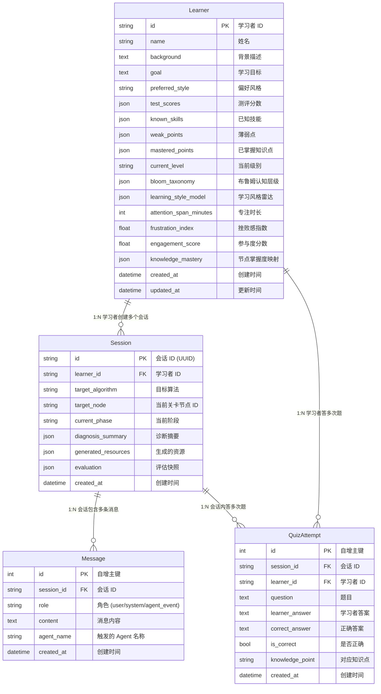

# AgentEdu 数据库设计文档

> 文档版本: v1.0 | 最后更新: 2026-06-22
>
> 数据库引擎: **SQLite 3.x** | ORM: **SQLAlchemy 2.0**
> 定义文件: `backend/models.py`

---

## 一、ER 关系图

---

## 二、表结构详解

### 2.1 `learners` — 学习者表

跨会话持久存储画像与能力雷达。

| 字段 | 类型 | 说明 | 索引 |
|------|------|------|------|
| `id` | String PK | 学习者唯一 ID | ✅ |
| `name` | String | 显示名称 | |
| `knowledge_mastery` | JSON | 知识图谱深度映射: `{node_id: mastery_score}` | |
| `frustration_index` | Float | 0.0~1.0，越高越沮丧 | |
| `engagement_score` | Float | 0.0~1.0，越高越活跃 | |

### 2.2 `sessions` — 会话表

一次完整学习交互的生命周期。

| 字段 | 类型 | 说明 | 索引 |
|------|------|------|------|
| `id` | String PK | UUID | ✅ |
| `learner_id` | String FK | 关联 learners.id | |
| `target_node` | String | 缓存 key，当前关卡节点 ID | |
| `generated_resources` | JSON | 存放完整的生成资源 | |

> **缓存策略**: 查询 `(learner_id, target_node, generated_resources IS NOT NULL)` 判断是否命中缓存。

### 2.3 `messages` — 消息表

持久化所有交互历史。

| 字段 | 类型 | 说明 |
|------|------|------|
| `session_id` | String FK | 关联 sessions.id (索引) |
| `role` | String | `user` / `system` / `agent_event` |
| `agent_name` | String | 标记是哪个 Agent 产生的消息 |

### 2.4 `quiz_attempts` — 答题记录表

用于更新画像和评测追踪。

---

## 三、迁移说明

当前使用 SQLAlchemy `Base.metadata.create_all()` 自动建表。如果修改了表结构：

1. 删除本地 `agent_edu.db` 文件
2. 重启后端服务，表会自动重建
3. 如需保留数据，请使用 Alembic 迁移工具
